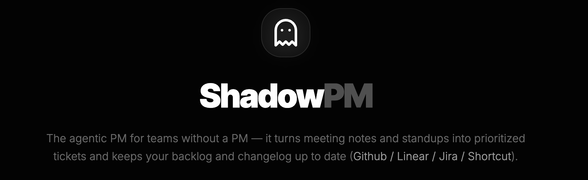

  

# ShadowPM

**Agentic PM that turns meeting notes + standups into prioritized GitHub issues, changelogs, and execution.**

🌐 **Live Demo:** https://shadowpm-907277113728.us-west1.run.app

---

## What is ShadowPM?

ShadowPM is an execution layer for product teams. It turns unstructured discussions into structured outcomes — decisions, risks, open questions, and PM-quality tickets — and then reconciles them against your existing backlog and recent GitHub activity.

It works as a PM for teams without a PM, and as a force multiplier for teams that already have PMs.

---

## How it works

### 1) Notes Sync (Granola → ShadowPM)
ShadowPM automatically syncs meeting notes from **Granola** via **Zapier**.  
Once synced, the notes appear in the ShadowPM UI and can be reviewed, searched, and processed into outcomes.

### 2) Outcome Extraction
From each meeting, ShadowPM extracts:
- Decisions
- Tickets / action items
- Risks / blockers
- Open questions

### 3) Backlog Reconciliation
ShadowPM compares extracted outcomes against:
- existing GitHub issues (backlog)
- recent commits / PRs

It then classifies each item as:
- **New**
- **Duplicate**
- **Update existing**
- **Likely shipped**

### 4) Review + Approve
A human can edit:
- ticket titles
- owners
- priority
- acceptance criteria

Then approve the final set of actions.

### 5) Execute
Once approved, ShadowPM creates/updates issues in GitHub and produces a clean weekly changelog summary.

---

## Key Features

- **Auto-sync Granola meeting notes** via Zapier  
- **PM-quality tickets** with clear titles + acceptance criteria  
- **Backlog reconciliation** (new vs duplicate vs update existing vs likely shipped)  
- **Human-in-the-loop approvals** (safe + editable)  
- **Weekly changelog + decision log** (week-on-week product memory)  
- **Traceability** back to source notes (quotes/timestamps)

---

## Why it matters

Teams move fast, but execution breaks down when:
- decisions get lost
- action items don’t become tickets
- owners/deadlines aren’t clear
- the backlog becomes noise

ShadowPM closes the loop from “what we discussed” to “what we shipped.”

---

## Status

This is an early prototype built for a hackathon-style workflow.  
Next steps include deeper Slack ingestion, Shortcut/Linear integrations, and richer product memory.

---

## Tagline

**PM-level organization for teams without a PM & a force multiplier for PMs — running quietly in the background, like a shadow.**

---

  
  
<em>Built as part of the Granola x Google Deepmind Hackathon</em>

